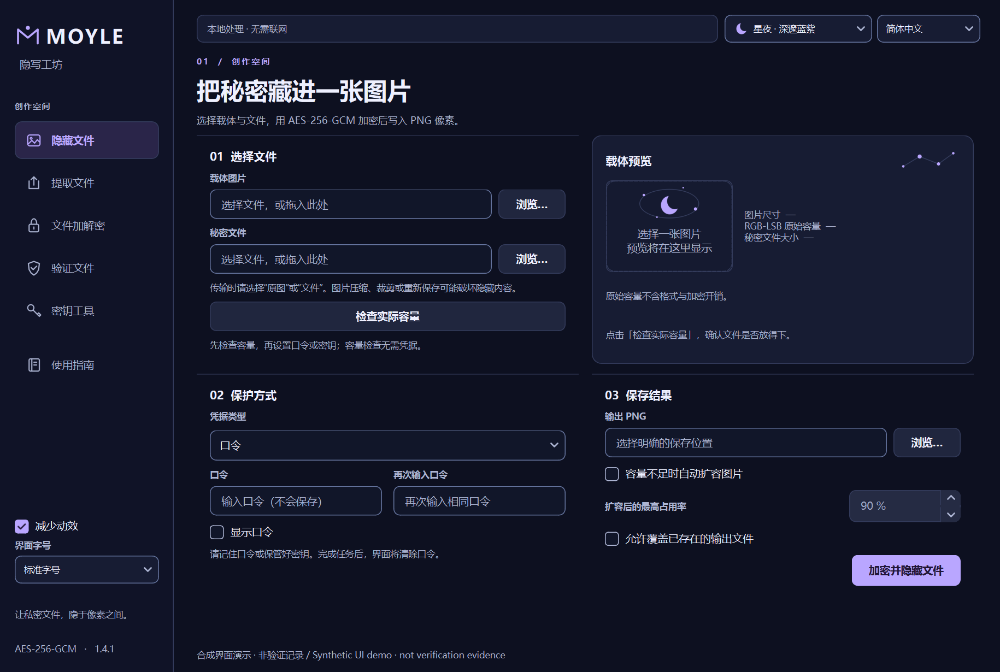
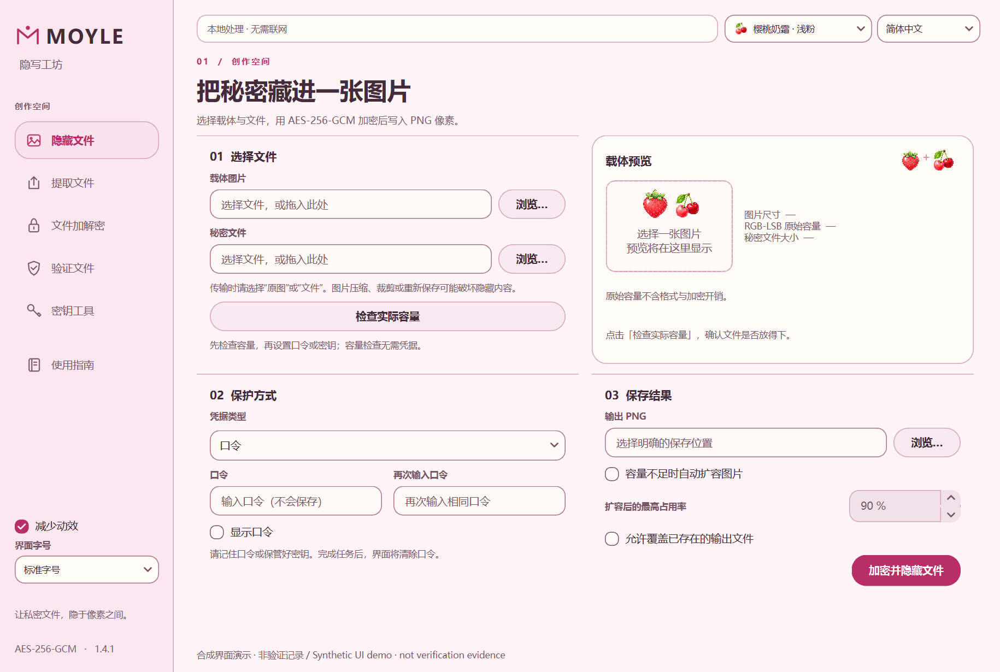
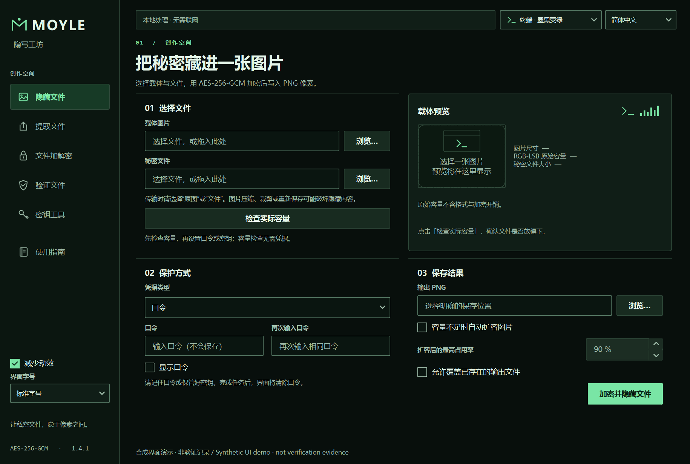

# Moyle 隐写工坊 · Steganography Studio

把秘密藏进一张图片。一个支持中英切换、三种主题的 Windows 桌面图片隐写与文件加密工具。

A bilingual Windows desktop application for encrypted PNG steganography and standalone file encryption, built with Python and PySide6.

**[下载 v1.4.1 / Download](https://github.com/MoyleT/MoyleSteg/releases/tag/v1.4.1)** · [使用说明 / User guide](README_DESKTOP.md) · [修复与验证记录 / Validation](docs/RELIABILITY_1.4.1.md)



## 功能 / Features

- **隐藏与恢复文件**：将加密载荷写入 PNG 像素，认证后按原文件名与格式恢复。
- **独立文件加密**：支持 `.saes` 容器，使用口令或随机 256-bit 密钥文件。
- **只读验证**：不写出明文，分别显示原始文件与完整容器的 SHA-256。
- **实际容量预检**：计算压缩后大小、容量占用率与可选扩容尺寸。
- **阶段进度与安全取消**：后台处理，清晰显示阶段与可用计数。
- **可切换外观**：深邃蓝紫、樱桃奶霜、墨黑荧绿；标准／大字号与紧凑窗口适配。

AES-256-GCM authentication, random salt/nonce, separate encryption/layout keys, original-name restoration, capacity preflight, cooperative cancellation and controlled recovery budgets are built in. All file processing runs locally.

## 快速开始 / Quick start

### Windows 便携版

1. 在 [Releases](https://github.com/MoyleT/MoyleSteg/releases/tag/v1.4.1) 下载 `MoyleSteg-1.4.1-Full-Project.zip`。
2. 解压整个项目包，打开 `dist/MoyleSteg/MoyleSteg.exe`。
3. 保留完整 `MoyleSteg` 目录和 `_internal`；EXE 单文件不能独立运行。

Python and runtime dependencies are included. Download the full project ZIP, extract it, and run `dist/MoyleSteg/MoyleSteg.exe`. GitHub's automatically generated **Source code** archives contain source only.

### 从源码运行

需要 Python 3.10+，桌面版面向 Windows。

```powershell
.\Setup-Desktop.ps1
.\.venv\Scripts\python.exe main.py
```

```powershell
# Qt-free core/service/tooling tests
.\.venv\Scripts\python.exe scripts/run_tests.py core --install

# Full desktop suite
.\.venv\Scripts\python.exe scripts/run_tests.py full --install
```

完整依赖、CLI 与构建说明见 [README_DESKTOP.md](README_DESKTOP.md)。

## 三种主题 / Three themes

| 樱桃奶霜 · Blossom | 墨黑荧绿 · Terminal |
| --- | --- |
|  |  |

主题保留一致的页面结构，并各自提供果汁、数据流或流星进度效果。截图均来自当前版本的合成演示界面；演示结果不作为认证测试证据。

[完成摘要](docs/screenshots/completion-summary.png) · [窄窗口与大字号](docs/screenshots/compact-large.png)

## v1.4.1 验证结果 / Validation

| 检查 | 结果 |
| --- | --- |
| 完整源码测试（Qt offscreen） | 615 项通过 |
| Windows 原生键盘／可访问接口／文本布局 | 20 项通过 |
| 独立 Qt 缩放模拟（125%／150%／200%） | 3 项通过 |
| 源码、新 EXE、解压后 EXE 原生自检 | 分别 55 项通过 |
| 1.4.0 ↔ 1.4.1 格式兼容 | 8 组通过 |
| 发布包清单 | 327 个项目文件逐项匹配 |

这些是维护方使用合成数据的运行结果，各组计数不相加。缩放模拟不等于全部物理显示器验证，也不是完整无障碍或正式密码学审计。详细范围与早前可恢复的原生诊断记录见 [版本说明](docs/RELIABILITY_1.4.1.md)。

## 文件与凭据 / Files and credentials

请原样传输隐写 PNG。缩放、裁剪、重新保存或平台重压缩可能破坏隐藏数据；恢复预算不足时应保留原文件并检查设备资源。妥善备份口令或密钥，丢失凭据后没有恢复后门。

Preserve the original steganographic PNG and your credentials. The app does not guarantee that steganography is undetectable. Processing remains memory-based; resource controls do not constitute an operating-system snapshot.

## 项目资料 / Project notes

- [当前版本说明与截图](docs/RELIABILITY_1.4.1.md)
- [公开发布清单规则](docs/RELEASE.md)
- [第三方组件与素材说明](THIRD_PARTY_NOTICES.md)

本仓库从已核验的 v1.4.1 发布快照开始。历史说明中的基线提交号属于本地开发历史，原始诊断报告、个人文件与开发缓存不在此仓库中。
